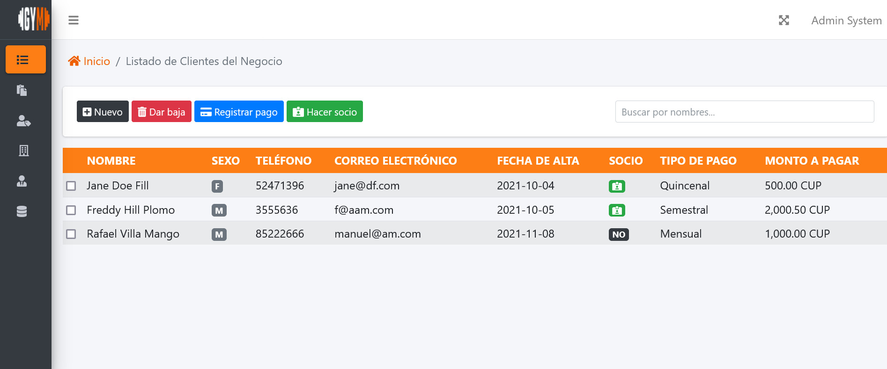
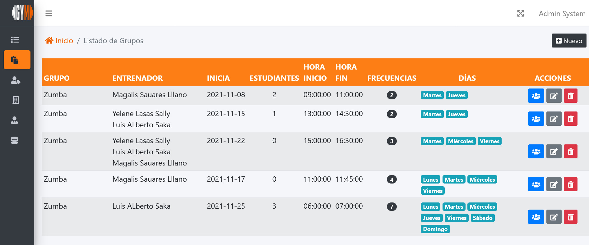

# Sistemas de Gestión de Gimnacio

Una plataforma para los propietarios de gimnasios y estudios de fitness que desean ahorrar tiempo y gestionar su base de clientes. Permiten tener el control de tu negocio, por lo que no tienes que preocuparte por las cosas pequeñas: desde la programación y la gestión de miembros hasta los pagos y la generación de informes

## Comenzando 🚀


### Pre-requisitos 

- Composer https://getcomposer.org/
- PHP 7.4+
- Habilitar en el php.ini las extensiones para trabajar con sqlite

### Instalación

```bash
$ git clone https://github.com/carlosgg21/gym.git
```
```
$ cd gym
$ composer install
```


## Funciones actuales 


## Preview

  


## Tecnología utilizada en el proyecto. 
 Lumen (8.2.3) (Laravel Components ^8.0)


## License

The Laravel framework is open-sourced software licensed under the [MIT license](https://opensource.org/licenses/MIT).
